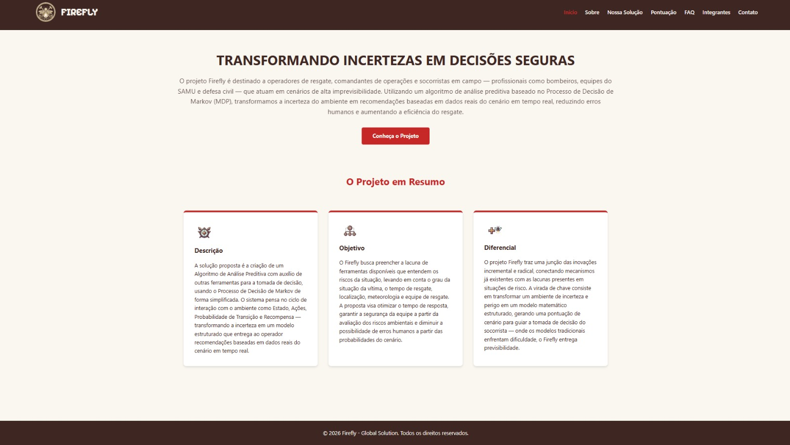
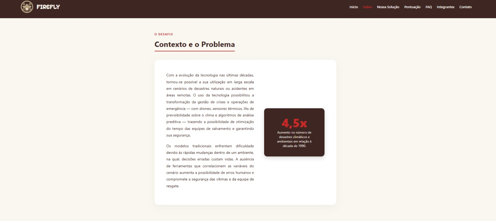
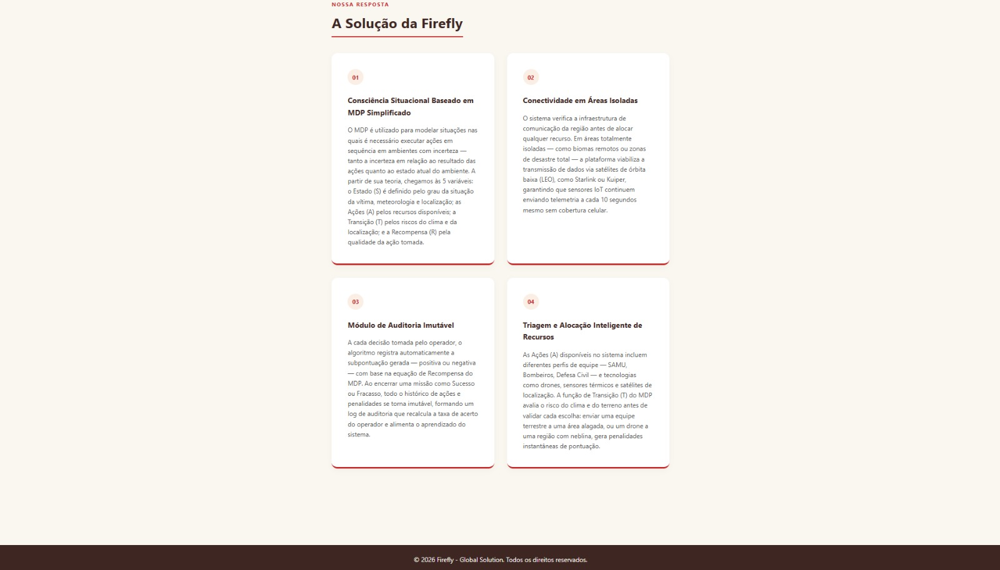
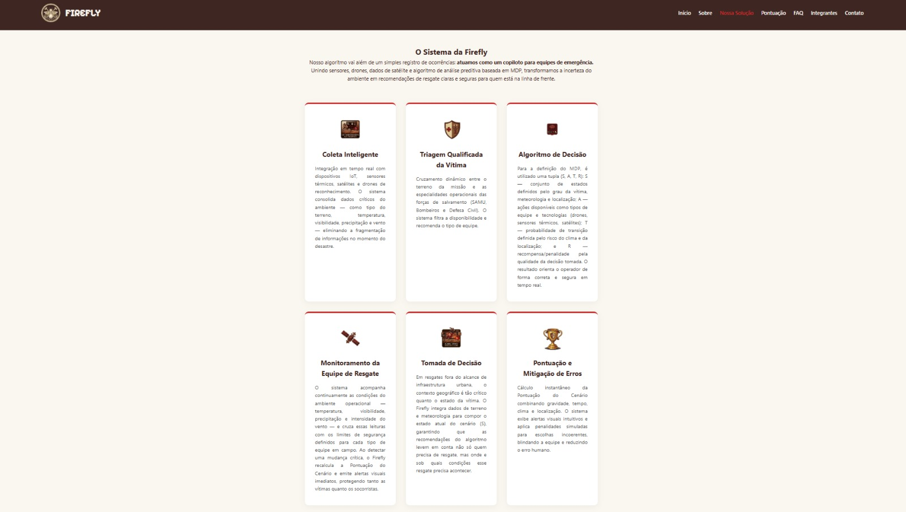
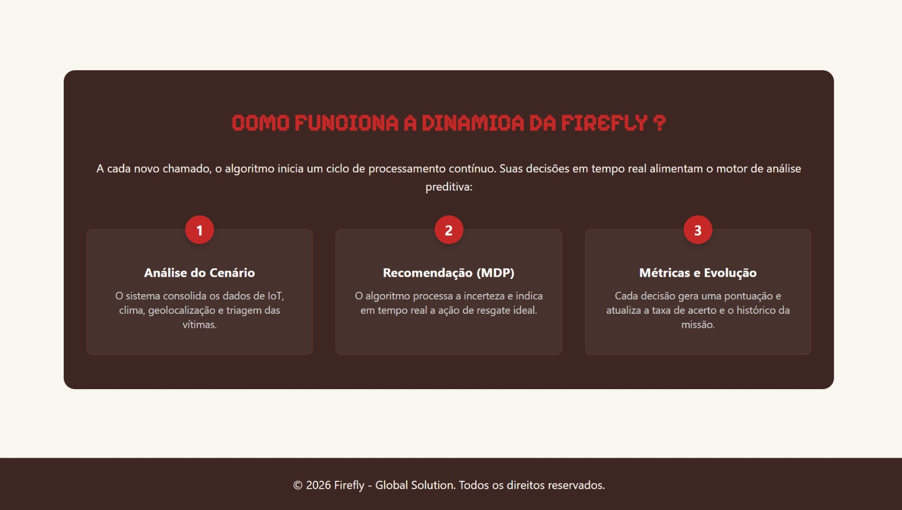
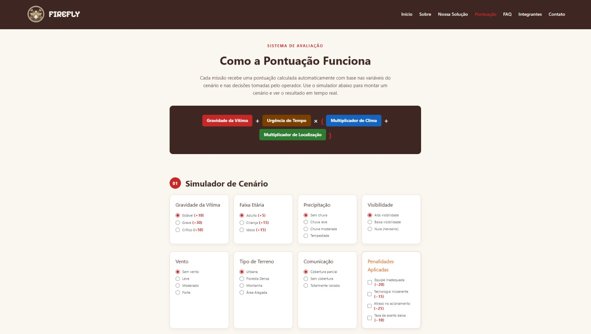
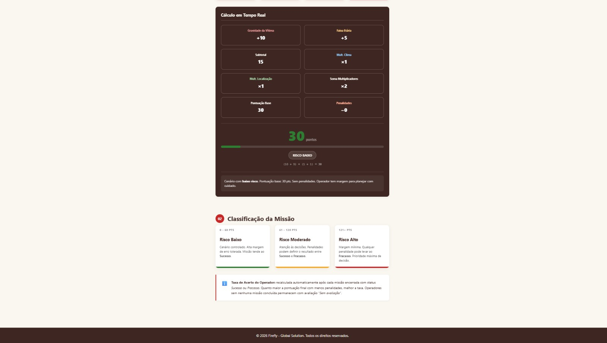
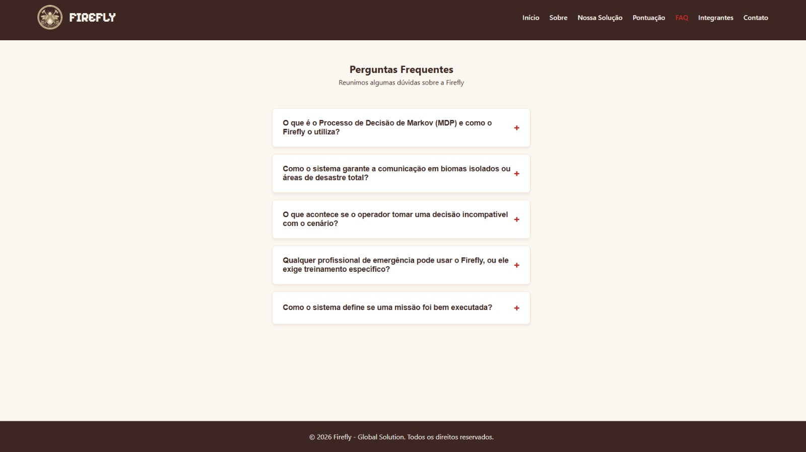
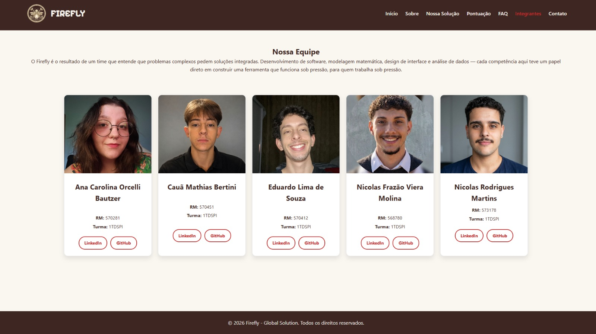
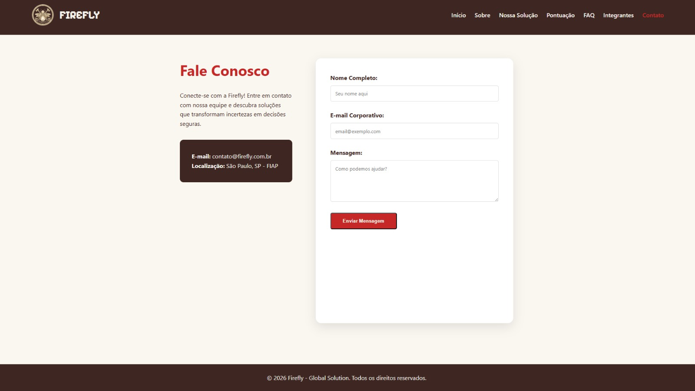

# 🔥 Firefly

Sistema inteligente de apoio à tomada de decisão em operações de resgate e gerenciamento de emergências.

## Sobre o Projeto

O Firefly é uma plataforma desenvolvida para auxiliar equipes de resgate, bombeiros, SAMU e Defesa Civil na tomada de decisões em cenários de alta complexidade e imprevisibilidade.

A solução utiliza conceitos de Análise Preditiva, Internet das Coisas (IoT), Inteligência Artificial e uma aplicação simplificada do Processo de Decisão de Markov (MDP) para transformar situações de risco em decisões baseadas em dados.

O sistema considera fatores como:

- Estado da vítima;
- Urgência do atendimento;
- Condições meteorológicas;
- Localização da ocorrência;
- Disponibilidade das equipes e recursos.

A partir dessas informações, o Firefly gera recomendações para auxiliar os operadores na escolha da melhor estratégia de resgate.

---

## Objetivo

Desenvolver uma ferramenta capaz de:

- Reduzir erros humanos em operações de emergência;
- Otimizar o tempo de resposta das equipes;
- Aumentar a segurança dos socorristas;
- Integrar tecnologias já existentes em uma única plataforma;
- Apoiar decisões através de análise preditiva.

---

## Tecnologias Utilizadas

Para a construção desta interface moderna, responsiva e fluida, foram utilizadas as seguintes tecnologias e ferramentas:

* **HTML5:** Estruturação semântica de todas as páginas da aplicação (`index.html`, `sobre.html`, `solucao.html`, `pontuacao.html`, `integrantes.html`, `faq.html` e `contato.html`).
* **CSS3:** Estilização baseada em arquitetura de design escalável, fazendo uso de:
    * *Variáveis CSS (Custom Properties)* para controle estrito da paleta de cores (60-30-10).
    * *CSS Grid Layout & Flexbox* para alinhamento dinâmico e organização em cards.
    * *Media Queries* aplicadas cirurgicamente para total responsividade em smartphones e tablets.
* **JavaScript:** Manipulação dinâmica do DOM para o funcionamento interativo do sistema de **Accordion** na página de FAQ (perguntas frequentes), gerenciando estados de expansão de texto e controle de `max-height`. E para a página Contato, na verificação das informações passadas pelo formulário.

---

## 📁 Estrutura do Projeto

```text
GLOBAL SOLUTION/
│
├── .vscode/
│   └── settings.json                  #Visual Studio Code (VS Code) para armazenar configurações específicas de um projeto.
│
├── assets/
│   ├── integrante01.jpeg              #Imagem Integrante
│   ├── integrante02.jpeg              #Imagem Integrante
│   ├── integrante03.jpeg              #Imagem Integrante
│   ├── integrante04.jpeg              #Imagem Integrante
│   ├── integrante05.jpeg              #Imagem Integrante
│   ├── logo.png                       #Imagem page Logo
│   ├── page-contato.jpeg              #Imagem page Contato
│   ├── page-faq.jpeg                  #Imagem page Faq
│   ├── page-inicial.jpeg              #Imagem page Inicial
│   ├── page-integrante.jpeg           #Imagem page Integrantes
│   ├── page-pontuacao.jpeg            #Imagem page Pontuacao
│   ├── page-pontuacao2.jpeg           #Imagem page Pontuacao
│   ├── page-sobre.jpeg                #Imagem page Sobre
│   ├── page-sobre2.jpeg               #Imagem page Sobre
│   ├── page-solucao.jpeg              # Imagem page Solucao
│   ├── page-solucao2.jpeg             # Imagem page Solucao
│   ├── px1.png                        #Imagem Ilustrativa Pixelada
│   ├── px2.png                        #Imagem Ilustrativa Pixelada
│   ├── px3.png                        #Imagem Ilustrativa Pixelada
│   ├── px4.png                        #Imagem Ilustrativa Pixelada
│   ├── px5.png                        #Imagem Ilustrativa Pixelada
│   ├── px6.png                        #Imagem Ilustrativa Pixelada
│   ├── px7.png                        #Imagem Ilustrativa Pixelada
│   ├── px8.png                        #Imagem Ilustrativa Pixelada
│   └── px9.png                        #Imagem Ilustrativa Pixelada
│
├── css/
│   └── style.css              # Folha de estilo unificada (Global, Componentes e Responsividade)
│
├── js/
│   └── main.js                # Lógica comportamental em JavaScript (Interação do FAQ e contato)
│
├── pag/
│   ├── contato.html           # Pagine de Contato Firefly
│   ├── faq.html               # Página de Dúvidas Frequentes (accordion interativo)
│   ├── integrantes.html       # Página sobre os integrantes (nome, rm, Linkedin e GitHub)
│   ├── pontuacao.html         # Página sobre a Funcionalidade da Pontuacao (nome, rm, Linkedin e GitHub)
│   ├── sobre.html             # Página Institucional (contexto e Missão Firefly)
│   └── solucao.html           # Página de continuação sobre o projeto (funcionalidade)
│
├── index.html                 # Página Inicial (apresentação e informações)
└── README.md                  # Guia técnico e informativo (este arquivo)
```

### 📁 Organização dos Diretórios

| Diretório | Descrição |
|------------|------------|
| `.vscode/` | Configurações do ambiente de desenvolvimento Visual Studio Code |
| `assets/` | Imagens, logotipo e recursos visuais utilizados no projeto |
| `css/` | Arquivos de estilização da aplicação |
| `js/` | Scripts JavaScript responsáveis pelas interações da interface |
| `pag/` | Páginas secundárias do sistema |
| `index.html` | Página principal da aplicação |


---

## Autores e Créditos

O desenvolvimento deste projeto foi idealizado e executado pela equipe de estudantes de **Análise e Desenvolvimento de Sistemas (ADS)** da **FIAP** na **Turma 1TDSPI**:

* **Ana Carolina Orcelli Bautzer** — RM 570281
  *Turma: 1TDSPI* 👉 [LinkedIn](https://www.linkedin.com/in/ana-bautzer/) | 👉 [GitHub](https://github.com/anabautzer)

* **Eduardo Lima de Souza** — RM 570412
  *Turma: 1TDSPI* 👉 [LinkedIn](https://www.linkedin.com/in/duduutech/) | 👉 [GitHub](https://github.com/duduutech)

* **Cauã Mathias Bertini** — RM 570451
  *Turma: 1TDSPI* 👉 [LinkedIn](https://www.linkedin.com/in/caua-mathias-bertini/) | 👉 [GitHub](https://github.com/cauabertini)

* **Nicolas Frazão Viera Molina** — RM 568780
  *Turma: 1TDSPI* 👉 [LinkedIn](https://www.linkedin.com/in/nicolas-molina-3a9257355/) | 👉 [GitHub](https://github.com/Frazaomol)

* **Nicolas Rodrigues Martins** — RM 573178
  *Turma: 1TDSPI* 👉 [LinkedIn](https://www.linkedin.com/in/nicolas-rodrigues-martins-126607360/) | 👉 [GitHub](https://github.com/NickRM22)

---


## Imagens e Representação do Projeto

Abaixo estão as representações visuais das telas que compõem a plataforma, demonstrando a consistência do design, o uso estratégico da paleta de cores institucional e a aplicação de técnicas avançadas de responsividade.
Serão implementadas.

### 1. Interface Desktop (Página Inicial - `index.html`)

*Legenda: Seção principal projetada com contraste refinado, tipografia focada na legibilidade e foco na conversão imediata do usuário para conhecer o projeto.*

### 2. Página Institucional (`sobre.html`)

      
*Legenda: Apresentação do contexto e problema com os tipos de soluções. *

### 3. Detalhamento da Funcionalidade (`solucao.html`)

  
*Legenda: Explicação detalhada do Sistema Firefly, regras e a dinâmica de pontuação para resgate.*


### 4. Sistema de Pontuacao (`pontuacao.html`)


*Legenda: Sistema de Pontuação para determinar tipos de riscos para resgate.*

### 5. Componente de FAQ Expandido (`faq.html`)

*Legenda: Menu do tipo Accordion tratando quebras de linhas de forma fluida através de manipulação dinâmica do DOM em JavaScript.*

### 6. Página do Time (`integrantes.html`)
  
*Legenda: Grid responsivo exibindo os cartões dos desenvolvedores com fotos customizadas e links integrados para redes profissionais.*

### 7. Canal de Atendimento e Feedback (`contato.html`)
  
*Legenda: Firefly Formulário estruturado com validação de campos para captação de mensagens de usuários*


---

## Link do Repositório

O código-fonte completo, histórico de evoluções e versionamento estruturado deste projeto podem ser acessados publicamente no GitHub através do link oficial:

**[Acesse o Repositório Oficial no GitHub](https://github.com/GlobalSolution-2026/GlobalSolution-FrontEnd)**

---

## Contato e Suporte

Para esclarecimento de dúvidas em relação ao projeto, feedbacks sobre a arquitetura responsiva, entre em contato através dos canais:

* **E-mail de Suporte:** contato@firefly.com.br
